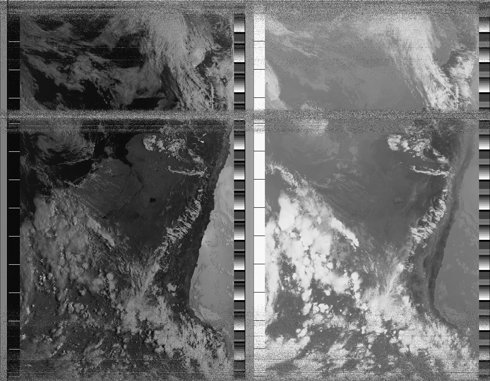
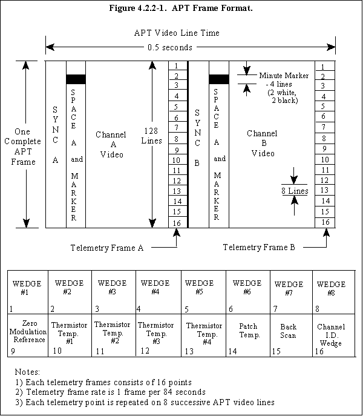

# Aptdemod



Aptdemod is a C program designed to demodulate Automatic Picture Transmission (APT) radio signals from NOAA satellites stored in 11025hz wav audio files. By processing the APT signals, the program extracts and reconstructs the image data outputting a weather satellite image. This provides weather visualizations from satellite transmissions. Ideal for amateur radio enthusiasts and weather monitoring applications, this decoder leverages signal processing techniques to deliver accurate and detailed images.

* Aptdemod audio input is limited to 11025hz wav files. Further compatibility is planned in future updates!

### What is APT
The Automatic Picture Transmission (APT) protocol is an analog image transmission system developed for use on weather satellites. It was introduced in the 1960s. A user station anywhere in the world can receive local data at least twice a day from each satellite as it passes nearly overhead.



For more details, please see the [additional information](https://en.wikipedia.org/wiki/Automatic_picture_transmission).

# Building / Installing
This program was developed for Linux. Additional platform compatibility will be implemented in future updates.

## Linux
Aptdemod has only been tested on Debian based distros.
In the future this will change, but in the mean time we recommend using Debian based distros. 

### Dependencies

<details>

<summary>Install Dependencies - Debian, Ubuntu, and other Debian-based distros</summary>

```bash
sudo apt install git cmake build-essential libfftw3-dev libsndfile1-dev
```

</details>
<details>

<summary>Install Dependencies - Red-Hat-based systems</summary>

```bash
# TBA
```

</details>
<details>

<summary>Install Dependencies - Arch-based systems</summary>

```bash
# TBA
```

</details>
<details>

<summary>Install Dependencies - Gentoo</summary>

```bash
# TBA
```

</details>

### Build aptdemod
```bash
# Clone aptdemod repo
git clone https://github.com/pat8901/aptdemod.git
cd aptdemod/build

# Generate makefile
cmake ../

# Build aptdemod
make

# Run
./aptdemod
```

# Quick Start
* There are a few audio samples that can be used when testing the program for the first time. These can be found in the cloned repo under "aptdemod/documentation/samples/audio". 
* When running the program just pass the file path for one of the samples as an argument.

* Aptdemod will output a bmp image in the same directory from which the program is called.

### Usage
```bash
aptdemod [options] [arguments]
```

### Available Options/Arguments
```
-h --help: Displays help menu, providing usage and miscellaneous information.
-a --about: Displays details about the program, including license information.
-v --verbose: Provide additional program information as it runs.
-f [file] --file [file]: This option is followed by a file path argument which tells the program what audio file to process.
```

### Sample command
```bash
$ ./aptdemod -f /path/to/audio/file/audio.wav
```
